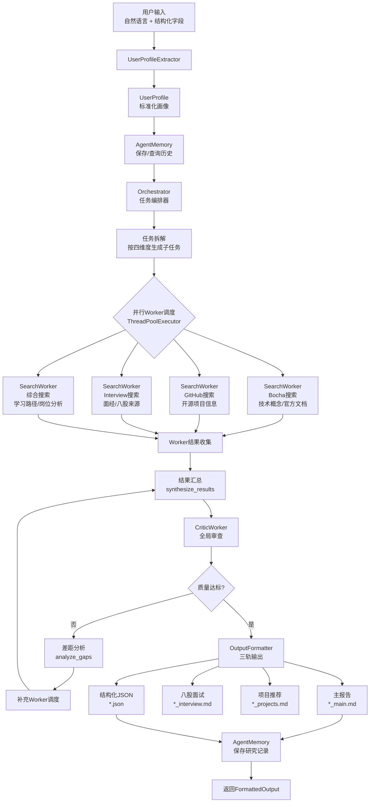

# AI求职助手 - 技术方案与架构设计

> **版本**: v1.0  
> **日期**: 2026-05-11  
> **选型方案**: 方案A（最小侵入式修改）

---

## 1. 方案选择记录

### 1.1 选型结论

采用 **方案A：最小侵入式修改**。在现有 Orchestrator-Workers 架构基础上做局部调整，复用已验证的任务拆解、并行调度、迭代优化、SSE 流式输出等核心骨架，仅替换或增加与求职场景相关的模块。

### 1.2 选型理由

1. **时间窗口优先**：暑期实习/秋招节奏紧张，方案A预估 3-5 天可完成核心改造，方案B需 7-10 天，风险更高。
2. **稳定性保障**：现有迭代优化循环和收益递减检测已经过验证，保留骨架可避免引入架构级 Bug。
3. **面试展示够用**：方案A的改造深度已足以支撑简历展示所需的功能亮点（垂直搜索、Critic Agent、结构化双轨输出、AgentMemory）。
4. **渐进式演进**：方案A完成后，若时间允许，仍可在其基础上逐步向方案B的流水线架构演进，而非一次性重写。

---

## 2. 新项目目录结构

```
deep_research/
├── __init__.py              # 【保留】包初始化
├── __main__.py              # 【保留】模块入口
├── api.py                   # 【微调】FastAPI服务，增加用户画像相关字段
├── config.py                # 【修改】增加垂直搜索配置、AgentMemory配置、输出配置
├── main.py                  # 【修改】DeepResearchAgent支持用户画像输入、三轨输出保存
├── orchestrator.py          # 【修改】增加结构化输出生成、CriticWorker集成、用户画像透传
├── output_formatter.py      # 【新增】将内部结构化数据渲染为 Markdown 报告 + JSON 文件
├── prompts.py               # 【修改】全面重构为面试语境（任务拆解、Worker、Critic、差距分析）
├── tools.py                 # 【修改】增加搜索客户端注册机制、GitHub/面经结果格式化
├── user_profile.py          # 【新增】用户画像解析、验证、Pydantic模型
├── workers.py               # 【修改】删除VisualizationWorker，弱化AnalysisWorker，新增CriticWorker
├── memory.py                # 【新增】AgentMemory：SQLite本地持久化用户画像和历史记录
└── search_clients/          # 【新增】垂直搜索客户端包
    ├── __init__.py          # 【新增】统一导出
    ├── base.py              # 【新增】搜索客户端抽象基类
    ├── bocha.py             # 【新增/迁移】Bocha通用搜索（从tools.py迁移并适配基类）
    ├── github.py            # 【新增】GitHub API项目搜索（stars/forks/语言/更新时间过滤）
    └── interview.py         # 【新增】面经站点搜索（牛客/力扣/知乎定向爬取/API）

tests/                       # 【新增】单元测试目录
├── __init__.py
├── test_search_clients.py   # 【新增】覆盖GitHub/Interview/Bocha搜索客户端
├── test_memory.py           # 【新增】覆盖AgentMemory CRUD
├── test_critic_worker.py    # 【新增】覆盖CriticWorker审查逻辑
└── test_output_formatter.py # 【新增】覆盖双轨输出格式化

research_output/             # 【保留】示例输出目录
├── .gitkeep

requirements.txt             # 【修改】更新依赖清单
.env.example                 # 【修改/新增】增加GitHub Token、面经API等环境变量模板
Dockerfile                   # 【新增】容器化部署
run.sh                       # 【新增】一键运行脚本
```

---

## 3. 核心模块划分与职责

| 模块 | 类型 | 职责说明 |
|------|------|----------|
| `config.py` | 保留+修改 | 全局配置中心。管理 LLM、搜索 API、Agent 迭代参数、来源质量规则、输出格式配置。 |
| `tools.py` | 保留+修改 | 基础工具层。封装 LLM 调用（OpenAI 兼容接口）、JSON/XML 提取、搜索结果格式化、搜索客户端注册表。 |
| `search_clients/` | 新增 | 垂直搜索层。统一封装 Bocha 通用搜索、GitHub API 项目搜索、面经站点搜索，对外暴露一致的 `SearchResponse` 接口。 |
| `user_profile.py` | 新增 | 用户画像层。解析自然语言+结构化字段，生成标准化 `UserProfile`，作为 Orchestrator 和 Critic 的决策输入。 |
| `memory.py` | 新增 | 记忆层。基于 SQLite 本地持久化用户画像、历史生成记录、薄弱点追踪，支持个性化推荐和重复查询优化。 |
| `prompts.py` | 修改 | 提示词层。全面替换为面试语境：任务拆解（学习路径/八股/项目/面试四维度）、Worker 执行提示、Critic 审查提示、差距分析提示。 |
| `workers.py` | 修改 | 执行层。`SearchWorker` 适配垂直搜索客户端；`CriticWorker` 新增（审查项目难度匹配度、八股高频覆盖度）；`WriterWorker` 保留；删除 `VisualizationWorker`；弱化 `AnalysisWorker`（合并入 SearchWorker）。 |
| `orchestrator.py` | 修改 | 编排层。保留任务拆解→并行调度→结果汇总→质量检查→迭代优化循环，增加：① 用户画像透传至子任务 ② CriticWorker 全局审查 ③ 结构化 JSON 中间态生成。 |
| `output_formatter.py` | 新增 | 输出层。将 `ResearchState` 中的内部结构化数据，按 `spec.md` 定义的 JSON Schema 渲染为 Markdown 报告和结构化 JSON 文件。 |
| `main.py` | 修改 | 入口层。`DeepResearchAgent` 增加 `user_profile` 入参，支持 `.md` + `.json` 双轨文件保存，`ConsoleReporter` 增加面试场景进度标签。 |
| `api.py` | 微调 | 服务层。保留 FastAPI 骨架，`ResearchRequest` 增加用户画像可选字段，响应模型增加结构化输出字段。 |

---

## 4. 关键接口/函数签名定义

### 4.1 用户画像层

```python
# user_profile.py
from pydantic import BaseModel, Field
from typing import Optional, List

class UserProfile(BaseModel):
    """标准化用户画像"""
    target_role: str = Field(..., description="目标岗位，决定八股范围和路径方向")
    time_budget: str = Field(..., description="可用准备时间，决定路径密度")
    company_tier: str = Field(..., description="目标公司层级，决定面试深度")
    current_level: Optional[str] = Field(None, description="当前水平，决定路径起点")
    focus_areas: List[str] = Field(default_factory=list, description="希望重点加强的方向")
    avoid_areas: List[str] = Field(default_factory=list, description="明确不需要的方向")
    raw_query: str = Field(..., description="用户原始自然语言输入")
    background_type: Optional[str] = Field(
        default=None,
        description="由LLM根据用户current_level和原始输入推断的背景类型"
    )

class UserProfileExtractor:
    """用户画像提取器：从自然语言+结构化字段中提取标准化画像"""

    def __init__(self, llm_client: Optional[LLMClient] = None):
        self.llm = llm_client or get_llm_client()

    def extract(self, query: str, **structured_fields) -> UserProfile:
        """
        提取用户画像。

        Args:
            query: 用户原始自然语言描述（支持 None/空字符串回退）
            **structured_fields: 可选结构化字段（target_role, time_budget等）
                - focus_areas / avoid_areas 支持字符串（中英文逗号均可）或列表

        Returns:
            UserProfile: 标准化用户画像
        """
        ...
```

### 4.2 记忆层

```python
# memory.py
import json
import uuid
from typing import Optional, List, Dict
from pathlib import Path

class AgentMemory:
    """Agent记忆：本地持久化用户画像和学习历史（基于 SQLite）"""

    def __init__(self, db_path: str = "./data/agent_memory.db"):
        self.db_path = db_path
        self._profiles: Dict[str, dict] = {}
        self._records: Dict[str, List[dict]] = {}
        self._weak_points: Dict[str, List[str]] = {}
        self._load()

    def _load(self):
        """从JSON文件加载。若文件损坏，会打印警告并重新初始化，避免静默数据丢失。"""
        ...

    def save_profile(self, profile: UserProfile) -> str:
        """保存用户画像，返回 profile_id"""
        ...

    def get_profile(self, profile_id: str) -> Optional[UserProfile]:
        """根据ID获取用户画像"""
        ...

    def get_or_create_profile(self, profile: UserProfile) -> str:
        """根据画像特征查找现有记录，不存在则创建，返回 profile_id"""
        ...

    def save_research_record(self, profile_id: str, record: Dict) -> None:
        """保存一次研究生成的记录（含输出摘要、质量分、时间戳）"""
        ...

    def get_recent_records(self, profile_id: str, limit: int = 5) -> List[Dict]:
        """获取用户最近N次生成记录，用于避免重复推荐"""
        ...

    def get_weak_points(self, profile_id: str) -> List[str]:
        """从历史Critic审查结果中聚合用户的薄弱点列表"""
        ...
```

### 4.3 垂直搜索层

```python
# search_clients/base.py
from abc import ABC, abstractmethod
from typing import Optional, Literal
from dataclasses import dataclass, field

@dataclass
class SearchResult:
    title: str
    url: str
    snippet: str
    site_name: str = ""
    date: str = ""
    metadata: Dict = field(default_factory=dict)  # 扩展字段（stars/forks/来源平台等）

@dataclass
class SearchResponse:
    query: str
    results: List[SearchResult] = field(default_factory=list)
    total_matches: int = 0
    success: bool = True
    error_msg: str = ""

class BaseSearchClient(ABC):
    """搜索客户端抽象基类"""

    @abstractmethod
    def search(self, query: str, **kwargs) -> SearchResponse:
        """执行搜索，返回统一格式的搜索结果"""
        ...

# search_clients/github.py
class GitHubSearchClient(BaseSearchClient):
    """GitHub项目搜索客户端"""

    def __init__(self, token: Optional[str] = None):
        self.token = token
        self.base_url = "https://api.github.com/search/repositories"

    def search(
        self,
        query: str,
        language: Optional[str] = "python",
        min_stars: int = 50,
        min_forks: int = 0,
        updated_after: Optional[str] = None,  # "2024-01-01"
        sort: str = "stars",
        order: str = "desc",
        per_page: int = 10,
    ) -> SearchResponse:
        """
        搜索GitHub项目，自动过滤低质量toy项目。
        返回结果中metadata包含：stars, forks, language, updated_at, topics
        """
        ...

# search_clients/interview.py
class InterviewSearchClient(BaseSearchClient):
    """面经站点搜索客户端（牛客/力扣/知乎）"""

    def search(
        self,
        query: str,
        source: Literal["nowcoder", "leetcode", "zhihu"] = "nowcoder",
        freshness: Optional[str] = None,  # "day", "week", "month", "year"
        per_page: int = 10,
    ) -> SearchResponse:
        """
        定向搜索面经内容。
        返回结果中metadata包含：source_platform, vote_count, view_count
        """
        ...
```

### 4.4 Worker 层

```python
# workers.py
class SearchWorker(BaseWorker):
    """
    增强版搜索Worker：支持多搜索客户端切换。
    根据子任务的expected_sources自动选择搜索客户端。
    """

    def __init__(
        self,
        worker_id: str = None,
        max_queries: int = 5,
        max_analysis_cycles: int = 3,
    ):
        super().__init__(worker_id)
        self.search_clients = {
            "bocha": BochaSearchClient(),
            "github": GitHubSearchClient(),
            "interview": InterviewSearchClient(),
        }
        # ... 原有预算和OODA逻辑保留 ...

    def execute(self, subtask) -> dict:
        """执行搜索任务，根据任务类型选择搜索客户端"""
        ...

    def _identify_information_gaps(self, results: List[SearchResult], subtask) -> List[str]:
        """
        识别信息空白（兼容中英文分词）。
        对中文文本按标点符号分词，对英文文本按空格分词，避免中文句子被当作单个关键词。
        """
        ...

class CriticWorker(BaseWorker):
    """
    Critic Worker：审查生成内容的质量和匹配度。
    专用于求职场景的垂直审查（区别于通用的quality_check）。
    """

    def execute(self, task: Dict) -> Dict:
        """
        执行审查任务。

        Args:
            task: {
                "content_type": "learning_path" | "interview_questions" | "project_recommendations" | "mock_interview",
                "content": str | dict,  # 待审查的内容
                "user_profile": UserProfile,  # 用于判断匹配度
                "criteria": List[str],  # 审查标准（可选）
            }

        Returns:
            dict: {
                "content_type": str,
                "overall_score": int,  # 0-100
                "dimensions": {
                    "difficulty_match": {"score": int, "comment": str},  # 难度匹配度
                    "coverage": {"score": int, "missing_topics": List[str]},  # 八股覆盖度
                    "freshness": {"score": int, "outdated_items": List[str]},  # 内容时效性
                    "practical_value": {"score": int, "comment": str},  # 实用价值
                },
                "is_toy_project": bool,  # 项目推荐专用：是否判定为toy项目
                "recommendations": List[str],  # 具体改进建议
                "pass_threshold": int,  # 通过阈值
                "passed": bool,
            }
        """
        ...
```

### 4.5 输出格式化层

```python
# output_formatter.py
from pydantic import BaseModel
from typing import Dict

class StructuredOutput(BaseModel):
    """结构化输出Schema（严格对应spec.md定义）"""
    task_id: str
    created_at: str
    user_profile: Dict
    learning_path: Dict
    interview_questions: Dict
    project_recommendations: List[Dict]
    mock_interview: List[Dict]
    meta: Dict

class FormattedOutput(BaseModel):
    """三轨输出"""
    markdown: str              # 主报告（执行摘要 + 学习路径）
    markdown_interview: str    # 八股知识点 + 模拟面试问答
    markdown_projects: str     # 项目推荐 + 关联面试题
    json_data: Dict            # 机器可读的结构化JSON
    metadata: Dict             # 生成元信息

class OutputFormatter:
    """输出格式化器：将ResearchState转为三轨输出（主报告/八股面试/项目推荐）"""

    def __init__(self, user_profile: Optional[UserProfile] = None):
        self.user_profile = user_profile

    def format(self, state: ResearchState) -> FormattedOutput:
        """
        将Orchestrator的ResearchState转换为双轨输出。

        Args:
            state: Orchestrator运行结束后的完整状态

        Returns:
            FormattedOutput: 包含markdown和json_data
        """
        ...

    def _build_structured_output(self, state: ResearchState) -> Dict:
        """从Worker结果中提取并按Schema组织结构化数据"""
        ...

    def _render_markdown(self, structured: Dict) -> str:
        """将结构化数据渲染为Markdown报告"""
        ...
```

### 4.6 编排层（修改点）

```python
# orchestrator.py
class Orchestrator:
    """
    保留原有迭代优化循环，增加求职场景适配：
    1. TaskPlan支持按四维度拆解（learning_path/interview_questions/project_recommendations/mock_interview）
    2. 结构化输出透传
    3. CriticWorker全局审查接入
    """

    def __init__(
        self,
        worker_factory: Callable,
        max_workers: int = None,
        on_progress: Callable[[str, dict], None] = None,
        user_profile: Optional[UserProfile] = None,
    ):
        ...

    def run(self, task: str, user_profile: Optional[UserProfile] = None) -> ResearchState:
        """
        执行完整的研究流程（增强版）。

        Args:
            task: 用户原始查询
            user_profile: 标准化用户画像（可选，若有则注入子任务和Critic）

        Returns:
            ResearchState: 包含final_report（Markdown）、structured_output（Dict）、迭代历史
        """
        ...

@dataclass
class ResearchState:
    """研究状态（扩展）"""
    original_task: str
    user_profile: Optional[UserProfile] = None
    task_plan: Optional[TaskPlan] = None
    worker_results: List[dict] = field(default_factory=list)
    final_report: str = ""                    # Markdown报告
    structured_output: Dict = field(default_factory=dict)  # 【新增】结构化JSON数据
    quality_score: int = 0
    status: str = "initialized"
    error_msg: str = ""
    start_time: float = 0
    end_time: float = 0
    iteration_count: int = 0
    iteration_history: List[IterationRecord] = field(default_factory=list)
    query_type: str = ""
    early_termination_reason: str = ""
    critic_result: Optional[Dict] = None      # 【新增】Critic审查结果
```

### 4.7 入口层（修改点）

```python
# main.py
class DeepResearchAgent:
    """Deep Research Agent - AI求职助手入口"""

    def __init__(
        self,
        verbose: bool = True,
        save_output: bool = True,
        output_dir: str = None,
        memory: Optional[AgentMemory] = None,
    ):
        self.verbose = verbose
        self.save_output = save_output
        self.output_dir = output_dir or OUTPUT_CONFIG["output_dir"]
        self.reporter = ConsoleReporter(verbose=verbose)
        self.memory = memory or AgentMemory()
        self.profile_extractor = UserProfileExtractor()

    def research(
        self,
        task: str,
        max_workers: int = None,
        callback: Callable[[str, dict], None] = None,
        user_profile: Optional[UserProfile] = None,
        **profile_fields,
    ) -> FormattedOutput:
        """
        执行深度研究任务（求职场景）。

        Args:
            task: 用户原始描述
            user_profile: 预解析的用户画像（如未提供则自动提取）
            **profile_fields: 结构化字段（target_role, time_budget等）

        Returns:
            FormattedOutput: 包含markdown报告和结构化JSON
        """
        ...
```

---

## 5. 数据流图

### 5.1 一次完整研究任务的数据流



### 5.2 数据流文字说明

1. **输入阶段**：用户输入自然语言描述（如"我是数学专业研一，想找大模型应用开发实习"），可选附带结构化字段（`target_role`、`time_budget` 等）。`UserProfileExtractor` 将其解析为标准化 `UserProfile`，同时 `AgentMemory` 查询该用户历史记录（如有）。

2. **拆解阶段**：`Orchestrator.decompose_task()` 接收画像后，按求职四维度拆解子任务：
   - `learning_path`：按 `time_budget` 和 `current_level` 生成阶段化学习路线
   - `interview_questions`：按 `target_role` 和 `company_tier` 组织八股清单
   - `project_recommendations`：按 `focus_areas` 和 `avoid_areas` 搜索匹配项目
   - `mock_interview`：基于前三者结果生成模拟问答

3. **执行阶段**：各 `SearchWorker` 根据子任务的 `expected_sources` 自动选择搜索客户端。例如项目推荐子任务自动路由到 `GitHubSearchClient`，面八股子任务自动路由到 `InterviewSearchClient` 和 `BochaSearchClient`。

4. **审查阶段**：所有 Worker 结果汇总后，`CriticWorker` 进行全局审查，重点检查：
   - 推荐项目是否为 toy 项目（`is_toy_project`）
   - 八股覆盖度是否完整（`missing_topics`）
   - 学习路径难度是否与 `current_level` 匹配（`difficulty_match`）

5. **迭代阶段**：若 Critic 未通过或质量分未达阈值，触发 `analyze_gaps()` 生成补充任务，调度补充 Worker，修订报告，最多迭代 `max_iterations` 次。

6. **输出阶段**：`OutputFormatter` 将最终状态中的结构化数据按 `spec.md` 定义的 JSON Schema 组织，同时渲染为 Markdown 报告。双轨文件保存至 `research_output/` 目录。

7. **记忆阶段**：`AgentMemory` 保存本次生成的摘要（含薄弱点、推荐项目列表、质量分），供下次查询时参考，避免重复推荐。

---

## 6. 技术选型说明

### 6.1 新增依赖

| 库名 | 用途 | 是否已有 | 备选方案 |
|------|------|----------|----------|
| **pydantic** (v2) | `UserProfile`、`StructuredOutput` 等数据模型验证与序列化 | 是（FastAPI自带） | dataclasses + 手动校验（不推荐） |
| **requests** | GitHub API、面经站点 HTTP 调用 | 是 | aiohttp（若后续需要异步化可替换） |
| **sqlite3** | AgentMemory 本地持久化 | 标准库 | json 文件（简单但查询弱，不推荐） |
| **python-dotenv** | 环境变量加载 | 是 | os.getenv 手动管理 |

### 6.2 搜索源技术方案

| 搜索源 | 技术方案 | 说明 |
|--------|----------|------|
| **Bocha 通用搜索** | 保留现有 REST API 调用 | 用于技术概念解释、官方文档搜索 |
| **GitHub 项目搜索** | GitHub REST API `search/repositories` | 需要 `GITHUB_TOKEN`（可选，无Token有速率限制）。支持 `stars:>50`、`language:python`、`sort=stars` 等过滤条件 |
| **面经站点搜索** | 混合策略：① Bocha 搜索时加入 `site:nowcoder.com` 等 site 限定；② 如可行，直接调用站点公开 API | 优先使用 Bocha + site 限定实现，降低开发成本。若后续需要更精准的面经抓取，再考虑爬虫方案 |

### 6.3 LLM 使用策略

| 场景 | 模型选择 | 原因 |
|------|----------|------|
| 任务拆解、报告综合、差距分析 | 配置中的 `model_smart`（如 qwen-max / deepseek-v4-pro） | 需要强推理能力 |
| Worker 搜索分析、Critic 审查 | 配置中的默认 `model`（如 qwen-plus / deepseek-v4-pro） | 平衡质量与成本 |
| 用户画像提取、查询扩展、简单格式化 | 配置中的 `model_fast`（如 qwen-turbo / deepseek-v4-flash） | 低成本快速响应 |

### 6.4 不引入的依赖（明确边界）

- **LangChain / LlamaIndex**：当前场景不需要复杂的 Chain 编排或文档索引，自建 Orchestrator 已足够。
- **向量数据库（如 chroma, faiss）**：RAG 层标记为"中优先级"但本次改造不做，AgentMemory 用 SQLite 即可满足。
- **前端框架（如 React, Vue）**：明确不做前端界面，命令行 + FastAPI 演示足够。
- **额外 LLM（GPT-4 / Claude）**：仅使用手头已有 API，控制成本。

---

## 7. 关键改造实施要点

### 7.1 对现有代码的最小改动清单

| 文件 | 改动范围 | 具体说明 |
|------|----------|----------|
| `orchestrator.py` | 局部新增 | `ResearchState` 增加 `structured_output` 和 `critic_result` 字段；`run()` 增加 `user_profile` 参数；迭代循环末尾增加 `OutputFormatter` 调用 |
| `workers.py` | 删除+新增 | 删除 `VisualizationWorker`；`AnalysisWorker` 保留但不再由 Orchestrator 主动调度；`SearchWorker` 的 `_assess_source_quality()` 修改面经/GitHub 的评分规则；新增 `CriticWorker` |
| `prompts.py` | 全面替换 | 所有提示词语境从"研究报告"改为"面试准备"，输出格式从 Markdown 长文改为结构化 JSON + 要点式 |
| `main.py` | 中等修改 | `research()` 签名增加 `user_profile` 和 `**profile_fields`；保存逻辑增加 `.json` 文件；`ConsoleReporter` 增加求职场景标签 |
| `tools.py` | 局部新增 | 增加 `register_search_client()` 和 `get_search_client_by_name()` 注册表机制 |
| `api.py` | 微调 | `ResearchRequest` 增加用户画像可选字段；响应模型增加 `structured_output` |

### 7.2 风险点与应对

| 风险 | 影响 | 应对策略 |
|------|------|----------|
| GitHub API 速率限制 | 项目搜索频繁时触发 403 | ① 使用 `GITHUB_TOKEN` 提高限额 ② 本地缓存搜索结果（SQLite）③ 降低 Worker 并行数 |
| Critic Worker 增加延迟 | 单次生成时间可能超过 5 分钟 | ① Critic 与最终迭代合并执行，不单独增加轮次 ② 设置 Critic 超时 60 秒 ③ 允许用户通过配置关闭 Critic |
| Prompt 重构后输出不稳定 | JSON 解析失败、格式错乱 | ① 保留 `extract_json()` 的容错逻辑 ② 为每个输出模块定义 Pydantic Schema 做二次校验 ③ 增加 `retry` 机制 |
| AgentMemory SQLite 并发 | FastAPI 多线程访问 SQLite | ✅ 已实施：`check_same_thread=False` + WAL 模式 + `threading.Lock` 写保护 |

---

> **下一步**：基于本 design.md 进入代码实现阶段。

---

## 8. 测试修复记录（2026-05-12）

基于 `spec.md` 和 `design.md` 对全模块进行了系统测试，覆盖正常用例、边界值、异常输入和失败场景。共发现 8 个 bug，已全部修复。

### 8.1 修复清单

| 文件 | Bug 描述 | 修复内容 | 影响接口/行为 |
|------|---------|---------|-------------|
| `user_profile.py` | `extract(None)` 崩溃 | 入口添加 `if not query: query = ""` 防御 | `UserProfileExtractor.extract()` 现在安全接受 `None` |
| `user_profile.py` | 中文逗号未分割 | `focus_areas`/`avoid_areas` 字符串分割前统一替换 `"，"` 为 `","` | 用户传入 `"RAG，Agent"` 正确拆分为列表 |
| `memory.py` | `_load()` 静默忽略损坏 JSON | 区分 `json.JSONDecodeError` 和普通异常，打印警告日志 | 数据文件损坏时用户会收到明确提示 |
| `workers.py` | `_identify_information_gaps` 对中文无效 | 改用正则按中英文标点分词，替代 `split()` | `SearchWorker` 中文信息空白识别准确率提升 |
| `workers.py` | `_expand_queries` 接受非字符串 | 添加 `str(task_description)` 类型转换 | `SearchWorker._expand_queries()` 鲁棒性增强 |
| `api.py` | `run_research_task` 无锁修改全局配置 | 引入 `threading.Lock()` 保护 `AGENT_CONFIG` 读写 | FastAPI 并发请求不再互相覆盖配置 |
| `search_clients/github.py` | `_parse_query` 未过滤危险字符 | 增加正则移除 `"'`;|--` 等注入风险字符 | GitHub 搜索查询安全性增强 |
| `config.py` | `high_quality_domains` 匹配过于宽泛 | 将 `"nature"` 等改为 `"nature.com"`、`"arxiv.org"` 等精确域名 | 来源质量评估误判率降低 |

### 8.2 测试覆盖

- **正常用例**: `UserProfile` 构造、`AgentMemory` CRUD、`OutputFormatter` 三轨拆分、`SearchWorker` OODA 循环、`CriticWorker` 审查流程
- **边界值**: 空输入、超长文本（50万字符）、零预算、None 字段、纯过滤条件查询
- **异常输入**: 缺失必填字段、类型不匹配、畸形标记、损坏 JSON、无效数字格式
- **失败场景**: 文件不存在/损坏/只读、网络超时、HTTP 403/500、LLM 调用失败、Worker 崩溃

### 8.3 回归测试

- `test_memory.py` — 4/4 通过
- `test_search_clients.py` — 6/6 通过
- `test_critic_worker.py` — 4/4 通过
- `test_comprehensive.py` — 23/23 通过
